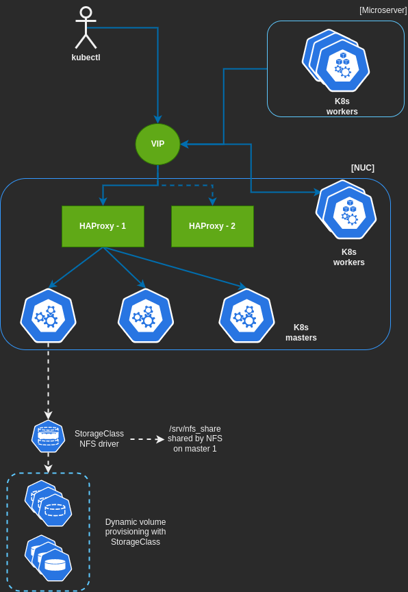

# Homelab

## Hardware

- Intel Nuc (i3, 24GB RAM, 512 SSD)
- HP Microserver Gen 8 (Celeron, 12Gb RAM, 2Tb RAID5)
- Zenbook 14 (Ryzen 7, 16Gb RAM, 512 NVMe)

Kubernetes cluster:

# WIP:

CKS certification + K8s deep diving.

### Storage

- NFS Server on Master 01 providing the neccesary Storage Class to Dynamically assign PVCs/Volumes on Helm deployments and manual PVCs if required for apps.
- Minio deployed on default namespace just for testing. Deployed with Helm.
- GlusterFS (deprecated) distributed on the 3 master nodes.

**Concept and main ideas for this stack:** Learn the different storage backends that exists on Kubernetes, from the simple ones like NFS, to more complex systems like Rook (Ceph). Have the right concepts about StorageClasses, PV, PVCs, Retain policies, different behaviours after deleting volumes, backups, etc.

### Monitoring stack 
- Prometheus + Grafana running on monitoring namespace. Deployed with Helm.

**Concept and main ideas for this stack:** Understand service discovery with Prometheus, learn the different ways to instrument the code, work with SLI/Os (Sloth as an example), learn PromQL and Grafana dashboards.

### Security
- Gatekeeper installed to add extra security layer on cluster, future Falco, image analysis, SCA, net policies, etc.

**Concept and main ideas for this stack:** Learn about the different tools/policies/behaviours that can provide a more secure cluster.

WIP:

- Falco to analyze system/kernel calls and extra security analysis.
- ROOK as storage provisioner instead of the NFS.
- DirectPV just for testing with virtual disks attached to VM.

Future additions:

- EFK stack